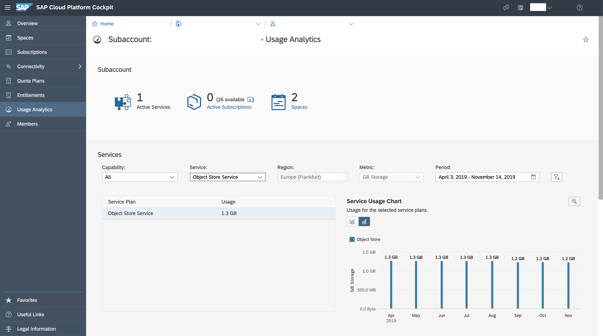
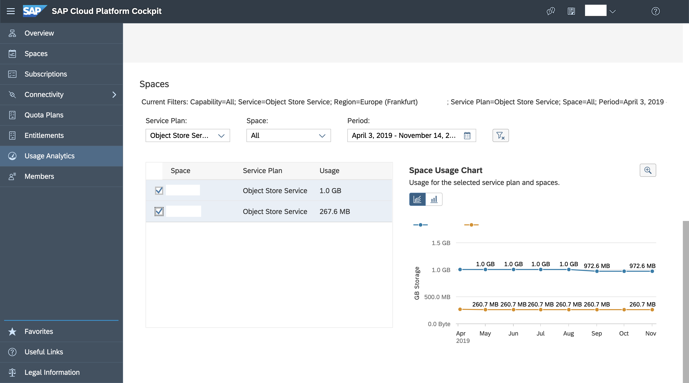

<!-- loio8c20208a0891482b90bc6192633239b8 -->

# Concepts

<a name="loio8c20208a0891482b90bc6192633239b8__section_mnc_kvy_sjb"/>

## Control Plane Operations

Object Store service offers standard cloud foundry service broker lifecycle operations. We refer to them as control plane operations. These include create-service, delete-service, bind-service, unbind-service, create-service-key, delete-service-key, and update-service. The create-service and delete service operations help in provisioning and deprovisioning of storage resources. The bind-service and create-service-key operations help in getting access credentials with other parameters in order to perform various operations on the provisioned object store resource. The unbind-service and delete-service-key operations help in invalidating the credentials that are generated as part of the bind-service/create-service-key operations. The update-service operation helps in making configuration-related changes on the existing service instance and the corresponding resource.

<a name="loio8c20208a0891482b90bc6192633239b8__section_crw_lvy_sjb"/>

## Data Plane Operations

Object Store service helps in provisioning resources and generating access credentials for users to directly access the underlying object store \(AWS S3 buckets, Azure Blob container, or Google Cloud Storage buckets\). It doesn't act as an interface for performing any kind of operations by users.

<a name="loio8c20208a0891482b90bc6192633239b8__section_j3d_nvy_sjb"/>

## Storage Classes

All the buckets created by the service are created in the standard storage class only. The other storage classes like infrequent tier, glacier etc. aren't supported.

<a name="loio8c20208a0891482b90bc6192633239b8__section_vwr_qvy_sjb"/>

## Region

Object Store service creates buckets/containers in the same region as the underlying infrastructure. For example, if the "objectstore" service instances are created in a subaccount that belongs to say AWS Frankfurt region, then the bucket is also created in the same region.

<a name="loio8c20208a0891482b90bc6192633239b8__section_twc_5vy_sjb"/>

## Monitoring Through Cockpit

Usage Analytics pages in the Cockpit provide a view of aggregated usage at various levels:

### Aggregated Usage \(storage\) at Cockpit subaccount level

### Aggregated Usage \(storage\) at Cloud Foundry spaces level

<a name="loio8c20208a0891482b90bc6192633239b8__section_vxm_dxy_sjb"/>

## Security

All the supported infrastructures provide storage solutions that are secure by default. Object Store service together with the underlying infrastructure ensures user authentication and authorization to control access to data. It enables access to buckets or containers by creating technical users, assigning limited set of permissions, and sharing corresponding credentials through service instance bindings or service keys. For more details on credentials, you can refer to the Object Store service's IaaS specific documentation.

<a name="loio8c20208a0891482b90bc6192633239b8__section_myw_tfj_tnb"/>

## SSL Configuration

<table>
<tr>
<th valign="top">

Infrastructure

</th>
<th valign="top">

SSL Configuration

</th>
</tr>
<tr>
<td valign="top">

AWS

</td>
<td valign="top">

Support only HTTPS

</td>
</tr>
<tr>
<td valign="top">

Azure

</td>
<td valign="top">

Support only HTTPS

</td>
</tr>
<tr>
<td valign="top">

GCP

</td>
<td valign="top">

Support both HTTP and HTTPS

</td>
</tr>
</table>

For the GCP infrastructure, we recommend that you use HTTPS. By default, `gsutil` makes use of HTTPS. But, if you are using any other way to store and access objects, see the documentation of the Google Cloud Platform, [gsutil tool](https://cloud.google.com/storage/docs/gsutil).

<a name="loio8c20208a0891482b90bc6192633239b8__section_lpb_kl5_qmb"/>

## Audit Logging

SAP doesn't perform data event logging on buckets created through SAP CP Object Store service. However, note that on AWS, SAP supports "server access logging" feature of AWS S3, that can be used to capture logs of data events. For more details, refer [Server Access Logging](server-access-logging-b03c5b9.md) topic.

<a name="loio8c20208a0891482b90bc6192633239b8__section_p4s_qy4_sqb"/>

## Backup and Restore Options

Object Store service enables customers to use various supported hyperscaler's object store offerings. It enables only the features the underlying hyperscalers already support. Therefore, there's no backup and restore feature provided by SAP Object Store service.

However, the objects are replicated across multiple availability zones within a region for high durability. The respective hyperscaler internally ensures that the objects are available even if an entire availability zone becomes unavailable. For more detail on the replication, see the Object Store service’s documentation for different IaaSes.

There are additional features that could also help in backup and restore in certain scenarios. For example, if there any objects are accidentally deleted, we recommend you to use the features like object versioning and expiration rules. Enabling versioning allows you to recover from accidental deletion and modification of objects because the hyperscalers keep older versions in case the objects are modified or deleted. In addition, setting expiration rules helps in automatic deletion of older versions. See the respective hyperscaler documentation of Object Store service for more details to learn about these features and to understand how these features could be used.

Also, if you want to prevent your blob stores from accidental deletion, prevent deletion feature is available. If you enable prevent deletion on your object store instance, Object Store service doesn’t delete the service instance, and hence the corresponding blob store, if there are one or more objects present within. In other words, having the flag enabled on your object store instance would prevent deletion of instances for nonempty buckets. It helps prevent any accidental deletion of an object store instance. For more information on default configurations and the recommendations, see[Backup and Restore](backup-and-restore-371e080.md) .

