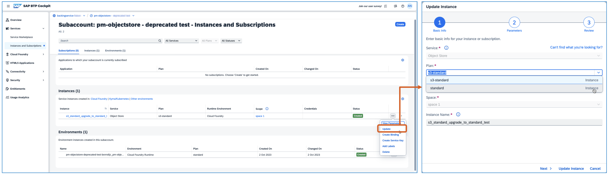
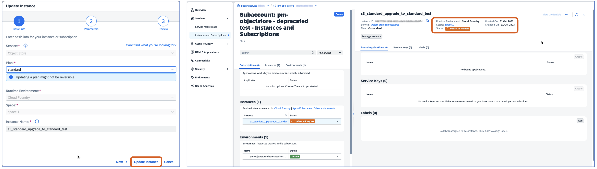

<!-- loiod891fb75cbfe4da79bf2253180376f25 -->

# Service Plan update to 'standard'

<a name="loiod891fb75cbfe4da79bf2253180376f25__section_lrd_tnp_nzb"/>

## IaaS specific plans deprecation and the new ‘standard’ plan

The ‘standard’ service plan aims to unify the delivery of the service in all supported hyperscalers and to simplify all the existing commercial plans. All IaaS specific plans’ capabilities are already under the ‘standard’ plan. So, we recommend considering the ‘standard’ plan for all new instances of the Object Store service.

<a name="loiod891fb75cbfe4da79bf2253180376f25__section_vp4_tnp_nzb"/>

## Recommended actions:

Please switch to the ‘standard’ plan when provisioning new instances.

Also, please plan to update all existing instances of deprecated plans to the ‘standard’ plan.

> ### Note:  
> Kindly note that on Azure, the update to ‘standard’ plan of the instances created until Q2’21 cannot be supported. Therefore, if not already migrated, please migrate those as per the migration documentation.

<a name="loiod891fb75cbfe4da79bf2253180376f25__section_ehx_tnp_nzb"/>

## Pre-requisites

You need to have entitlements of the ‘standard’ plan of Object Store service in your subaccount, without which the upgrade will fail.

<a name="loiod891fb75cbfe4da79bf2253180376f25__section_rfd_fqp_nzb"/>

## Important to know

**Moving to ‘standard’ plan is not considered an upgrade, it is a service plan update, as the legacy service plans are intended to be removed as commercial options, as part of the unification of offerings simplification goal.**

The ‘standard’ plan, provides the same service functionalities.

The legacy service plans are scheduled to be removed from the list of Eligible Cloud Services as of 15.01.2024 and will not be available for renewal terms that begin after the removal date.

Existing instances will not be impacted and will be available until the end of the current subscription term.

<a name="loiod891fb75cbfe4da79bf2253180376f25__section_tbh_5np_nzb"/>

## How to update?

**Via BTP Cockpit UI**

1.  Login to your global account and select the Object Store instance that you plan to update. By clicking on the 3 dots \(...\) you will be able to access the update option.

2.  You should then select the standard plan and proceed with the update.

    **Important:** To be able to choose standard you need to have the proper entitlements for standard plan.

    

3.  After you select “Update Instance” the system automatically changes the service plan for that specific instance without service disruption.

    **Important:** The update process does not remove any features or do any data migration, everything stays the same from a technical point of view, only the service metadata is updated.

<a name="loiod891fb75cbfe4da79bf2253180376f25__section_plg_lqp_nzb"/>

## Frequently Asked Questions

**Can I revert back?**

**No**. The update procedure is one way only, this means that you cannot revert back to the previous service plan.

**Who can update?**

All customers and partners under CPEA and PAYG consumption commercial models.

**Do I need to do any data migration?**

No data migration is necessary as the update happens only at service plan metadata level.

**Are all instances eligible for update?**

No, azure instances created until Q2’21 are not supported, please refer to the migration guide for more information.

**’The legacy service plans are scheduled to be removed from the list of Eligible Cloud Services as of 15.01.2024 and will not be available for renewal terms that begin after the removal date’. What does this mean?**

This means that for new customers \(CPEA, PAYG\) the legacy service plans will not be available as a choice after the date mentioned. This applies only for contracts/subscriptions with active date after. The list of eligible cloud services shows all services options available for customers and can be checked via SAP BTP Discovery Center.

**By when do customers need to complete changing the plan?**

Customers can continue to create instances with the legacy plans until the end of the current subscription term, existing instances are not affected. Once the subscription term ends, they will not be able to create new instances with the legacy plans, to keep existing instances after renewal they should update to ‘standard’ plan.

**If Customers do not change the plan, what will happen? Will it be changed automatically, or will it stop working?**

Customers can continue to use the instances, they will be available until the end of the current subscription, in case of renewal customers should update to ‘standard’ plan if they want to keep using it. SAP does not have plans to automatically update the service plan, the process is a simple update procedure available via BTP Cockpit instance update option.

**The price of legacy plans is different, does this mean the cost will be different when the plan is changed?**

With the ‘standard’ plan, the cost is going to be unified across all hyperscalers and is different. Customers should be aware of this change if they decide to update before the current subscriptions term.

**I'm facing some technical problems. How do I seek support?**

For any technical issues, please create a ticket in the component BC-CP-CF-OSAAS.

